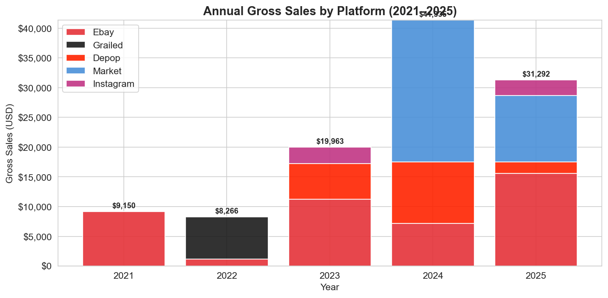
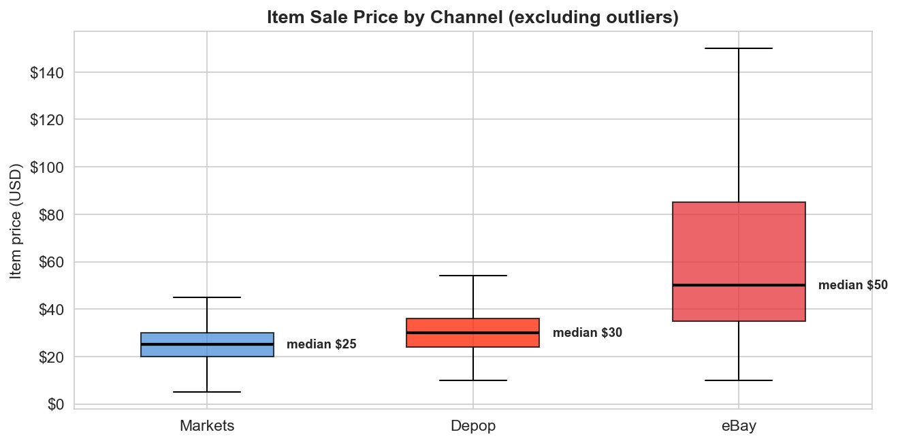
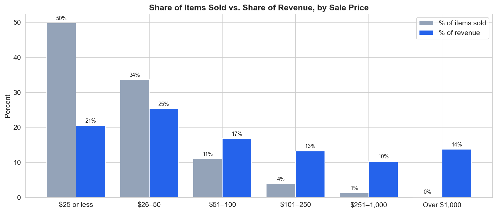
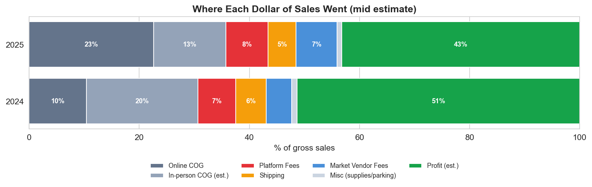

# Vintage Resale Business - Data Analysis (2021-2025)

End to end analysis of five years of my own resale business data: **~$110k in gross sales and ~1,460 itemized sales** across eBay, Depop, Grailed, Instagram, and New England flea markets.

I built a Python pipeline that turns tax forms, marketplace exports, and handwritten market notes into clean datasets, analyzed them in a Jupyter notebook, and loaded them into a PostgreSQL database for further SQL analysis.

**Tools:** Python (pandas, pdfplumber, regular expressions, matplotlib) · PostgreSQL (schema design, constraints, views, CTEs, window functions) · Jupyter · Git

---

## Key Findings

| | Finding |
|---|---|
| **Growth** | Online sales held flat at ~$17.5k/year (2023–2025). **Nearly all growth came from in-person markets**, which grew from $2.7k to $23.9k and made up 58% of 2024 sales. |
| **Channels** | eBay paid **$83 per sale vs. $39 on Depop**, even though Depop's fees were lower (12.6% vs. 13.9%). Take-home per sale mattered more than fee rate. |
| **Price tiers** | Median sale: **$25 at markets, $30 on Depop, $50 on eBay**. Footwear sold 92% online; tops and tees sold 77% in person. Low-priced items sell best in person, without listing or shipping. |
| **What makes money** | The top 10% of sales brought in **46% of revenue**. The biggest wins were vintage Levi's denim and 1980s L.L.Bean bags, and returns depended on how cheaply each item was sourced. |
| **Profit** | Estimated profit of **~$21k (2024) and ~$13.5k (2025)**, 41–60% margins across cost scenarios. A previously recorded 2025 profit of $1,111 was understated by roughly $12,000. |
| **Timing** | Spring is the strongest online season (March); fall is weakest. Depop listings sold in a **median of 8.5 days**. |



---

## Data Corrections

Most of the work in this project was making sure every number traces back to a source. Rebuilding from raw data caught several errors in my original records:

- **Market sales were understated by over $5,000.** A hand-typed 2024 estimate of $8,000, and later a hand-typed market log that didn't match my notes (and was missing three market days), were replaced with totals calculated from ~900 itemized sales parsed from handwritten notes.
- **The 2025 profit figure was wrong by ~$12,000.** It subtracted market vendor fees but left out $13.8k in market and Instagram sales.
- **A fee comparison was backwards.** Depop originally looked more expensive than eBay; putting both platforms on the same basis (fees ÷ item price + shipping, weighted by dollars) reversed the result.
- **SQL data-quality checks found 18 duplicate Depop sales** (from overlapping export files) and **25 refunded sales** still counted as revenue. Both were fixed in the Python pipeline so the notebook and the database use the same corrected data.

---

## Project Structure

```
vintage-resale-analytics/
├── data/
│   ├── raw/                 ← tax forms, exports, notes (private, not in repo)
│   └── processed/           ← cleaned CSVs produced by the pipeline
├── src/
│   └── parse_data.py        ← extraction and cleaning pipeline
├── notebooks/
│   └── vintage_resale_analysis.ipynb   ← analysis, charts, findings
├── sql/                     ← PostgreSQL schema, data checks, and analysis
├── images/                  ← exported charts
└── requirements.txt
```

### Pipeline

```
1099-K PDFs ─────────┐
eBay / Depop CSVs ───┤
Flyp inventory CSVs ─┼──► parse_data.py ──► data/processed/*.csv ──┬──► Jupyter notebook
Handwritten notes ───┤                                             └──► PostgreSQL
Expense records ─────┘
```

**Data sources and how they were handled:**
- **1099-K tax forms (PDF):** monthly sales extracted with `pdfplumber` and regular expressions
- **eBay Seller Hub exports:** junk header rows skipped; refunds matched to orders by order number
- **Depop exports:** duplicates from overlapping date ranges removed; refunds removed; listing dates kept for time to sell analysis
- **Handwritten market notes (PDF):** ~900 sales parsed line by line, handling two price formats, seller sections, expense lines, and daily totals
- **Flyp inventory tracker (2022):** item-level cost, sale price, and purchase dates

---

## Analysis

### Python notebook

[`notebooks/vintage_resale_analysis.ipynb`](notebooks/vintage_resale_analysis.ipynb) answers five business questions:

1. How did the business grow, and where did the money come from?
2. When do sales happen?
3. Which sales channel is worth it?
4. What actually makes money?
5. Is the business profitable?

It ends with data limitations, key takeaways, and business implications.





### SQL (PostgreSQL)

| File | What it does |
|---|---|
| [`01_schema.sql`](sql/01_schema.sql) | Tables with primary keys, foreign keys to a platforms lookup table, and `CHECK` constraints |
| [`02_load_and_verify.sql`](sql/02_load_and_verify.sql) | How the CSVs were loaded, plus row count and total checks |
| [`03_data_quality.sql`](sql/03_data_quality.sql) | Duplicate and missing value checks; fixes for cost placeholders, inconsistent labels, and whitespace |
| [`04_update_depop_and_reload.sql`](sql/04_update_depop_and_reload.sql) | Migration adding Depop listing date, brand, and category |
| [`05_views.sql`](sql/05_views.sql) | `all_sales` view combining four sales tables; `market_days` calculated from itemized sales |
| [`06_categories_and_brands.sql`](sql/06_categories_and_brands.sql) | Keyword-based category and brand tagging (`CASE` + `ILIKE`); revenue and channel by category |
| [`07_days_to_sell.sql`](sql/07_days_to_sell.sql) | Time from listing (or purchase) to sale, by price and category |
| [`08_window_functions.sql`](sql/08_window_functions.sql) | Year-over-year growth, running totals, top sales per platform, and revenue deciles |

SQL results were cross checked against the notebook: total gross sales ($110,005.70), itemized sales (1,461), market days, and year-over-year growth all match.

**Example: top 3 sales on each platform**

```sql
WITH ranked AS (
    SELECT platform, item, price,
           RANK() OVER (PARTITION BY platform ORDER BY price DESC) AS rank_in_platform
    FROM all_sales
)
SELECT platform, rank_in_platform, item, price
FROM ranked
WHERE rank_in_platform <= 3;
```



---

## Limitations

- Itemized sales cover ~64% of gross sales; 2021 and 2023 eBay sales exist only as annual totals.
- Cost of goods for in person sales wasn't recorded, so profit is shown as a range under stated assumptions.
- Annual totals come from 1099-K forms, which report payments before refunds (~1% overstated).
- Only sold items are recorded, so time-to-sell excludes inventory that never sold.

Full details are in the notebook's Data Limitations section.

---

## How to Run

The raw files are personal tax and sales records and aren't included, so the pipeline can't be re-run from this repo. The processed CSVs are included, so the notebook and SQL can be run.

```bash
pip install -r requirements.txt
python src/parse_data.py          # rebuilds data/processed/ (requires raw data)
jupyter notebook notebooks/vintage_resale_analysis.ipynb
```

**Database (PostgreSQL):** create a database, then run `01_schema.sql`, load the CSVs as described in `02_load_and_verify.sql`, and run `03`, then `05` through `08`. (`04` is only needed to update a database built before those columns existed.)

---

## About

Built by **Richard Rowe**, a Computer Science graduate (UMass Lowell, math minor) who has run this resale business since 2021.

- GitHub: [rrowe99](https://github.com/rrowe99)
- LinkedIn: [richard-f-rowe](https://www.linkedin.com/in/richard-f-rowe/)